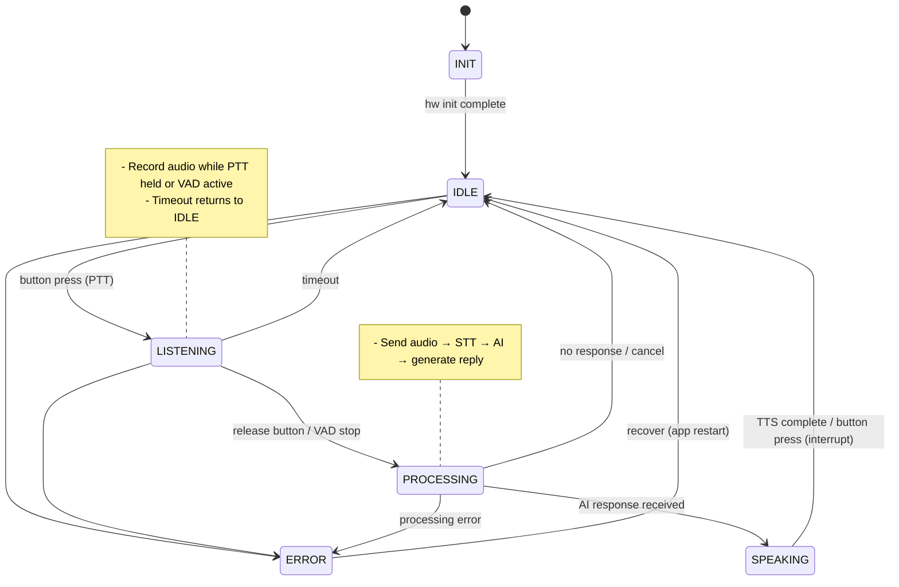

# BBB Voice Assistant - Project Plan

> **Beaglebone Black Voice Assistant** - thiết bị trợ lý giọng nói trên embedded Linux, tích hợp AI Local server, hiển thị trên TFT LCD SPI.

## 📋 Tổng quan

### 🎯 Mục tiêu
Xây dựng thiết bị embedded Linux hoàn chỉnh trên Beaglebone Black với:
- **Voice Interaction:** Push-to-talk voice input, speech-to-text qua AI local.
- **Visual Feedback:** Hiển thị trạng thái và phản hồi trên TFT LCD 320x480.
- **Audio Output:** Text-to-speech và phát âm thanh qua speaker.
- **Physical Controls:** Buttons cho điều khiển thủ công, LEDs cho status.


## 💎 Giá trị mang lại

| Khía cạnh | Giá trị |
|-----------|---------|
| **Học tập** | Device driver, HAL design, embedded Linux system programming |
| **Kỹ thuật** | Modern C++17, design patterns, layered architecture |
| **Thực tế** | Production-quality code, error handling, logging, testing |
| **Mở rộng** | Dễ thay đổi hardware, AI Backend, thêm tính năng mới |

               

## ⚙️ Yêu cầu kỹ thuật

### ✅ Functional Requirements
| ID | Yêu cầu | Mức độ |
|----|---------|--------|
| FR-1 | Ghi âm khi nhấn PTT button | Must have |
| FR-2 | Target language for voice interaction: English | Must have |
| FR-3 | Speech-to-text qua LM Studio API | Must have |
| FR-4 | Chat completion với AI local | Must have |
| FR-5 | Text-to-Speech và phát âm thanh | Must have |
| FR-6 | Hiển thị trạng thái trên LCD | Must have |
| FR-7 | 1 LED cho status/error | Should have |
| FR-8 | tăng/giảm volume bằng 2 nút bấm | Should have |

### 📊 Non-Functional Requirements
| ID | Yêu cầu | Target |
|----|---------|--------|
| NFR-1 | Thời gian phản hồi (PTT release → TTS start) | < 5 giây |
| NFR-2 | RAM usage | < 200 MB |
| NFR-3 | Boot time | < 30 giây |

### 🚧 Technical Constraints
| Constraint | Chi tiết |
|------------|----------|
| **Hardware** | Beaglebone Black (512MB RAM, 4GB eMMC, 16GB SD-Card) |
| **OS** | Debian Linux (kernel 4.x+) |
| **Build system choice** | Buildroot |
| **Cross-compilation host OS** | Windows WSL2 with Ubuntu 22.04 |
| **Network** | USB connection to PC (LM Studio) |
| **AI Server** | LM Studio trên PC riêng (OpenAI-compatible API) |
| **Display** | SPI TFT LCD ILI9341 (320x480, RGB565) — custom driver |
| **Button** | 2 nút tăng/giảm volume (GPIO, libgpiod) |
| **Audio** | I2C audio codec IC (e.g. WM8960), I2S data, external mic/speaker |


## 🏗️ Kiến trúc được chọn

### 📐 Layered Architecture với HAL

```mermaid
flowchart TB
   subgraph APP [APPLICATION LAYER]
      VA[VoiceAssistant<br/>(state machine)]
      DC[DisplayController<br/>(LVGL UI)]
      BC[ButtonController<br/>(GPIO events)]
   end

   EB[Event Bus / IPC]

   subgraph MID [MIDDLEWARE LAYER]
      AP[AudioPipe]
      AI[AIClient]
      TTS[TTS Engine]
   end

   subgraph HAL [HAL LAYER (interfaces)]
      IA[IAudioHAL]
      ID[IDisplayHAL]
      IG[IGPIOHAL]
   end

   subgraph HALimpl [HAL Implementations]
      Alsa[AlsaHAL]
      Fbdev[FbdevHAL]
      Gpiod[GpiodHAL]
   end

   subgraph KERNEL [KERNEL / DRIVERS]
      ALSA[ALSA subsystem]
      SPI[SPI LCD driver]
      GPIO[GPIO (gpiod)]
   end

   APP -->|publishes/subscribes| EB
   EB --> MID
   MID -->|calls| IA & ID & IG
   IA --> Alsa
   ID --> Fbdev
   IG --> Gpiod
   Alsa --> ALSA
   Fbdev --> SPI
   Gpiod --> GPIO

   classDef layer fill:#f8f9fa,stroke:#333,stroke-width:1px;
   class APP,MID,HAL,HALimpl,KERNEL layer;
```

```text
ASCII (compact):
|-----------------------------|
| APPLICATION LAYER           |
| VoiceAssistant  DisplayController  ButtonController |
|           (Event Bus)       |
|-----------------------------|
| MIDDLEWARE LAYER            |
| AudioPipe  AIClient  TTS    |
|-----------------------------|
| HAL INTERFACES              |
| IAudioHAL  IDisplayHAL  IGPIOHAL |
|-----------------------------|
| HAL IMPLEMENTATIONS         |
| AlsaHAL  FbdevHAL  GpiodHAL |
|-----------------------------|
| KERNEL / DRIVERS            |
| ALSA  SPI LCD  GPIO (gpiod) |
|-----------------------------|
```

### Gợi ý / Recommendations
- **Event Bus / IPC:** `POSIX message queue`. Low latency (~0.5ms)
- **Interface stability:** Define and document `IAudioHAL`, `IDisplayHAL`, `IGPIOHAL` (threading, blocking, error model).
- **Testing:** Provide `mock_HAL` implementations and unit tests for `VoiceAssistant` and middleware.
- **Docs:** Add sequence diagrams for main flows (PTT → STT → AI → TTS → Playback) in `docs/architecture.md`.
- **Versioning:** Add HAL semantic versioning to support gradual driver/impl upgrades.

### Tại sao chọn Layered Architecture?
| Tiêu chí | Đánh giá |
|----------|----------|
| **Separation of Concerns** | Mỗi layer có trách nhiệm rõ ràng |
| **Testability** | Mock HAL để test application không cần hardware |
| **Portability** | Đổi hardware chỉ cần implement HAL |
| **Maintainability** | Dễ debug, dễ understand |
| **Phù hợp embedded** | Minimal |

## Technical Decisions
| Component | Choice | Key reason | Alternative (Future) |
|-----------|--------|------------|----------------------|
| Architecture | Layered + HAL | Maintainability, testability | Microservices (scale) |
| IPC / Event Bus | POSIX message queue | Low latency, simplicity | Unix socket, D-Bus |
| Audio | ALSA (libasound) + I2C codec IC | Embedded standard, flexible | PulseAudio/Pipewire |
| Audio Codec | I2C-based IC (WM8960 or similar) | I2C control + I2S data | Direct I2S (no codec IC) |
| LCD Driver | Custom SPI + DMA (ILI9341) | Learning value, full control | Pre-built fbdev (faster) |
| Network | USB to PC (LM Studio) | Direct, no network stack | Ethernet (future) |
| TTS | eSpeak-ng | Offline, lightweight | Cloud TTS (quality) |
| AI/LLM | LM Studio (OpenAI-compat) | Local, easy, privacy | Ollama/vLLM/Cloud |
| GUI | LVGL | Lightweight, production-grade | Raw Framebuffer |
| Serialization | JSON | Human-readable, easy debug | Protobuf (performance) |
| Logging | spdlog | Fast, modern C++ | syslog (system) |
| GPIO | libgpiod | Modern, maintained | sysfs (legacy) |

## State Machine



```text
ASCII (compact):
 [*] -> INIT
 INIT -> IDLE  (hw init complete)
 IDLE -> LISTENING  (button press / PTT)
 IDLE -> ERROR
 LISTENING -> PROCESSING  (release / VAD stop)
 LISTENING -> IDLE  (timeout)
 LISTENING -> ERROR
 PROCESSING -> SPEAKING  (AI response received)
 PROCESSING -> IDLE  (no response / cancel)
 PROCESSING -> ERROR
 SPEAKING -> IDLE  (TTS complete / interrupt)
 SPEAKING -> ERROR
 ERROR -> IDLE  (restart app)
```
### Valid State transitions
| From | To (allowed) |
|------|--------------|
| INIT | IDLE, ERROR  |
| IDLE | LISTENING, ERROR |
| LISTENING | PROCESSING, IDLE (timeout), ERROR |
| PROCESSING | SPEAKING, IDLE (no response), ERROR |
| SPEAKING | IDLE (TTS complete / interrupt), ERROR |
| ERROR | IDLE (restart app) |

## Hardware

### Beaglebone Black Pin Mapping
- **Power:** 5V/GND via barrel jack or microUSB
- **I2S Audio:** I2S0 pins (P9: 31, 29, 30, 32) → I2C audio codec IC (WM8960, ALC5623, etc.)
  - I2C control: I2C0 (P9: 17/18)
  - Analog output: codec IC → amp → speaker
  - Analog input: mic → preamp → codec IC
- **SPI LCD:** SPI0 pins (P9: 17, 18, 21, 22) → ILI9341 (custom driver)
  - SPI mode: 0, clock: 10-20 MHz, DMA recommended
- **GPIO (buttons, LEDs):** GPIO0 or GPIO1 (libgpiod)
  - PTT button, volume +/-, status LED
- **USB to PC:** microUSB connector (power + data) or separate USB cable
  - Connection: BBB ↔ PC (LM Studio runs on PC)
  - Protocol: HTTP over USB Ethernet adapter (if needed) or direct socket

### Connectivity
- **Primary:** USB to PC (LM Studio)
  - No Ethernet needed for MVP
- **Fallback:** Optional Ethernet for future scaling

→ cần tạo hardware_setup.md với chi tiết wiring diagram

## Project Structure (not done)
Khuyến nghị cần có các mục quan trọng: kernel, hal, middleware, app, config (json), scripts, tests, common,...

## Timeline Overview
| Tuần | Phase | Deliverables |
|------|-------|--------------|
| **1** | Foundation | BBB boot, image build, device tree, hardware setup, drivers |
| **2** | HAL Layer | Audio/Display/GPIO HAL, shared libs, Cmake |
| **3** | Middleware + App | Audio pipeline, AI client, TTS, state machine, LVGL UI |
| **4** | Integration | Full pipeline, error handling, systemd service, docs |
-> cần tạo chi tiết timeline.md và link nó ở đây.

## Documentation Index (tham khảo)
| Tài liệu | Nội dung | Status |
|----------|----------|--------|
| PLAN.md | Tổng quan, yêu cầu kỹ thuật, phương án, phân tích | ✅ Draft |
| architecture.md | Interface definitions, class diagrams, design patterns | ⏳ Pending |
| hardware_setup.md | BBB pinout, wiring diagrams, device tree overlays | ⏳ Pending |
| build_system.md | **Buildroot setup, cross-compilation, kernel/DTB, image deploy** | **✅ Draft** |
| timeline.md | Weekly breakdown with daily tasks, milestones | ⏳ Pending |
| troubleshooting.md | Common build/runtime issues and solutions | ⏳ Pending |
| development/coding_guide.md | C++ techniques, error handling, logging patterns | ⏳ Pending |
| development/device_driver.md | SPI LCD (ILI9341) driver, registers, DMA setup | ⏳ Pending |
| development/hal_layer.md | IAudioHAL, IDisplayHAL, IGPIOHAL design, mocks | ⏳ Pending |
| development/app_layer.md | VoiceAssistant state machine, event bus, LVGL UI | ⏳ Pending |

## Key decisions log
| # | Decision | Options | Chosen | Rationale |
|---|----------|---------|--------|-----------|
| 1 | GUI Framework + Backend | Raw FB/LVGL/Qt | **LVGL + custom SPI driver** | Lightweight, production-grade, direct control of LCD |
| 2 | Audio API + Codec | ALSA/PulseAudio (± codec IC) | **ALSA + I2C codec IC** | Direct control, I2C mixer, integrated solution |
| 3 | Voice Trigger | Wake word/Push-to-talk (PTT) | **Push-to-talk (PTT)** | Simpler, reliable, practical |
| 4 | AI Backend + Network | Cloud/Local + Eth/USB | **Local (LM Studio) via USB** | Privacy, direct connection to PC |
| 5 | TTS | eSpeak-ng/Flite/Remote | **eSpeak-ng** | Offline, lightweight, good enough |
| 6 | Serialization | Protobuf/JSON/CBOR | **JSON** | Human-readable, simple |
| 7 | GPIO API | sysfs/libgpiod | **libgpiod** | Modern, chardev, not deprecated |
| 8 | IPC / Event Bus | Unix socket/mq/inproc | **POSIX message queue** | Low latency, simplicity |
| 9 | LCD Driver | Pre-built fbdev/Custom SPI | **Custom SPI + DMA** | Learning value, full control over ILI9341 |
| 10 | Audio Codec IC | No codec/I2C codec | **I2C-based codec IC** | Flexible, integrated solution, easier control |

## Out of Scope (Future considerations)
- DRM/KMS display driver (fbdev sufficient for now)
- Wake word detection (push-to-talk only)
- Multi-language TTS (English only initially)
- Cloud AI integration (local only)
- Plugin Architecture (monolithic app)
- Ethernet integration (USB sufficient for MVP)
