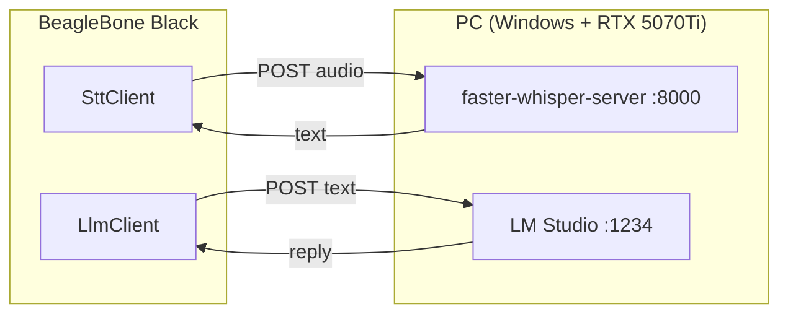

# Kiến thức: AI Server trên PC (STT + LLM)

> Tài liệu học tập (tiếng Việt theo Rule §18). Nền tảng *vì sao* đằng sau hai server chạy trên PC. Phần thao tác cài đặt cụ thể (Windows + RTX 5070Ti) nằm ở [../server_setup.md](../server_setup.md). Bối cảnh: CLAUDE.md §5 (Network & Service Topology).

---

## 1. Bức tranh tổng thể: vì sao là PC, không phải BBB?

BBB không tự chạy AI. Mọi tính toán nặng (nhận dạng tiếng nói + sinh văn bản) **offload sang PC**. BBB chỉ là client mỏng: thu audio → gửi đi → nhận chữ → đọc lên.



> Liên kết BBB↔PC đi qua **RJ45 LAN** (CLAUDE.md §5).

Hệ quả thiết kế quan trọng: **trọng số model không nằm trên BBB** → đó là lý do NFR-2 (<200MB RAM) khả thi (CLAUDE.md §10). Nếu một ngày bạn định nhét model vào BBB, ngân sách RAM sẽ vỡ ngay.

---

## 2. Vì sao **hai** server riêng, không phải một?

Câu hỏi nền: tại sao không một "AI server" làm tất cả?

> **Đáp:** STT và LLM là hai bài toán khác nhau, hai model khác nhau, hai API khác nhau. LM Studio (tính tới giữa 2026) **không có** endpoint transcription — nó chỉ phục vụ chat completions. Đây là khoảng trống được xác nhận trong CLAUDE.md (Risk Register, Decision #6).

Tách đôi còn cho hai lợi ích:
1. **Chẩn đoán lỗi rõ ràng** — "STT chết" hay "LLM chết" là hai trạng thái phân biệt được trên LCD (CLAUDE.md §9). Gộp lại thì không biết cái nào hỏng.
2. **Thay thế độc lập** — đổi model Whisper không đụng LLM và ngược lại.

Đây cũng là lý do phía BBB có **hai** client tách biệt `SttClient` + `LlmClient`, không phải một "AiClient" ([../architecture.md](../architecture.md) §6).

---

## 3. STT — Whisper & "ASR" là gì

**ASR** (Automatic Speech Recognition) = chuyển audio → text. Whisper (OpenAI) là model ASR mã nguồn mở phổ biến.

### 3.1 Các "bản" Whisper — đừng nhầm
"Whisper" có nhiều cách triển khai, hiệu năng rất khác:

| Bản | Ngôn ngữ chạy | Tăng tốc | Đặc điểm |
|-----|---------------|----------|----------|
| `openai/whisper` | Python (PyTorch) | GPU | bản gốc, chậm, nặng |
| **faster-whisper** | Python + CTranslate2 | GPU/CPU | **nhanh hơn 4× cùng độ chính xác**, ít VRAM → ta chọn |
| `whisper.cpp` | C++ | CPU (chủ yếu) | gọn, không cần Python, hợp máy yếu |

**Quyết định dự án:** `faster-whisper-server` (một HTTP server bọc faster-whisper, phơi API kiểu OpenAI). Lý do: có GPU RTX 5070Ti → tận dụng CUDA; API OpenAI-compatible khớp thẳng cách viết `SttClient`.

> CTranslate2 là engine inference tối ưu (quantization INT8/FP16, fused kernels). "faster" đến từ đây, không phải từ model khác.

### 3.2 Model size & lượng tử hóa
Whisper có nhiều cỡ: `tiny → base → small → medium → large-v3`. Lớn hơn = chính xác hơn nhưng chậm + tốn VRAM hơn.

Với 16GB VRAM và mục tiêu cân bằng tốc độ/chất lượng cho **tiếng Anh**:
- `large-v3-turbo` hoặc `distil-large-v3` — gần bằng large-v3 về độ chính xác nhưng **nhanh hơn nhiều**. Đây là điểm ngọt.
- Compute type `float16` (hoặc `int8_float16`) trên GPU.

Câu hỏi tự kiểm: *vì sao không luôn dùng `large-v3` cho chính xác nhất?* → Vì NFR-1 (<5s tổng). STT chỉ được ~0.5–1.5s trong ngân sách (CLAUDE.md §NFR-1). Model lớn quá ăn hết ngân sách đó.

### 3.3 API hình dạng OpenAI
faster-whisper-server phơi: `POST /v1/audio/transcriptions`, body `multipart/form-data` gồm `file` (audio) + `model` + tùy chọn `language`, `response_format`. Trả JSON có trường `text`.

→ `SttClient` (libcurl) chỉ cần: dựng multipart, đặt `language=en`, đọc `text`. Định dạng audio gửi: WAV/PCM 16kHz mono (khớp NFR-4 → không phải resample). Xem [audio_alsa.md](audio_alsa.md).

---

## 4. LLM — LM Studio & serving

### 4.1 LM Studio là gì
App desktop (Windows/Mac/Linux) để tải + chạy LLM local, và phơi một **OpenAI-compatible server** (`/v1/chat/completions`, `/v1/models`). Ta dùng vì: cài đặt dễ (GUI), tự quản GPU offload, API chuẩn (Decision #3 LLM).

### 4.2 GGUF & quantization — vì sao quan trọng với VRAM
LM Studio chạy model định dạng **GGUF** (từ llama.cpp). Model gốc FP16 rất to; **quantization** nén trọng số xuống 4–8 bit để vừa VRAM:

| Quant | Bit/trọng số | Chất lượng | VRAM (model 7-8B) |
|-------|--------------|------------|-------------------|
| Q8_0 | ~8 | gần như gốc | ~8GB |
| Q5_K_M | ~5 | rất tốt | ~5.5GB |
| **Q4_K_M** | ~4 | tốt, mất rất ít | ~4.5GB |

> Quy tắc thực dụng: **Q4_K_M là mặc định tốt**. Dưới Q4 chất lượng tụt rõ; trên Q5 lợi ích nhỏ mà tốn VRAM.

### 4.3 Chọn model cho RTX 5070Ti 16GB (cân bằng thông minh/tốc độ)
16GB VRAM khá rộng. Ba mức:

| Mức | Ví dụ model | VRAM (Q4_K_M) | Khi nào |
|-----|-------------|---------------|---------|
| Nhanh | Llama 3.2 3B / Qwen2.5 3B | ~2-3GB | ưu tiên latency tuyệt đối |
| **Cân bằng** ⭐ | **Qwen2.5 7B / Llama 3.1 8B** | ~5-6GB | điểm ngọt cho dự án này |
| Thông minh hơn | Qwen2.5 14B | ~9-10GB | ưu tiên chất lượng, chấp nhận chậm hơn |

Khuyến nghị: **bắt đầu với 7-8B Q4_K_M**, đặt **toàn bộ layer trên GPU** (full GPU offload — 16GB thừa sức). Nếu thấy câu trả lời còn nhanh và muốn "thông minh hơn", thử 14B Q4 rồi *đo lại NFR-1*. Đừng nhảy thẳng 14B rồi than chậm.

### 4.4 Tham số ảnh hưởng độ trễ
- **max_tokens / câu trả lời dài** — LLM sinh tuần tự từng token; trả lời dài = lâu. Đặt system prompt yêu cầu *trả lời ngắn gọn* để giữ NFR-1.
- **context length** — không cần lớn cho hỏi-đáp ngắn; context to ăn VRAM.
- **temperature** — không ảnh hưởng tốc độ, chỉ ảnh hưởng độ "sáng tạo".

---

## 5. Ngân sách độ trễ (gắn NFR-1 < 5s)

```
PTT release → [STT 0.5–1.5s] → [LLM 1–3s] → [TTS 0.2–0.5s] → audio bắt đầu
              + round-trip mạng LAN ~vài chục ms
```
Tổng phải < 5s (CLAUDE.md NFR-1). Quan sát then chốt: **độ trễ do PC quyết, không phải BBB**. Hai đòn bẩy lớn nhất bạn kiểm soát được:
1. Cỡ model LLM (mục 4.3) — đòn bẩy mạnh nhất.
2. Độ dài câu trả lời (system prompt ngắn gọn).

STT với GPU + model turbo thường đã nằm gọn trong ngân sách.

---

## 6. Mạng & bảo mật LAN

- Cả hai server **mặc định không xác thực**. An toàn trên LAN cô lập, nhưng **đừng port-forward** ra internet (CLAUDE.md §5).
- LM Studio phải bật "serve on local network" (bind `0.0.0.0`) để BBB ngoài `localhost` gọi được.
- Đặt **IP tĩnh cho PC** trên LAN để `config.json` của BBB không phải đổi mỗi lần reboot.
- Windows Firewall: mở inbound cho cổng `1234` (LM Studio) và `8000` (Whisper) **giới hạn trong subnet LAN**, không Public.

Chi tiết từng bước: [../server_setup.md](../server_setup.md).

---

## 7. Khởi động & xử lý "PC chưa sẵn sàng"

Boot BBB xong **không** đảm bảo PC đã bật server (NFR-3 chỉ tính boot BBB). Vì vậy:
- `SttClient`/`LlmClient` đặt **connect timeout ngắn (~3s)** → phát hiện server chưa bật nhanh, chuyển ERROR có thông báo, thử lại ở PTT kế tiếp (CLAUDE.md §9).
- Nên có **health check** lúc khởi động: `GET /v1/models` (LM Studio) và endpoint tương ứng của Whisper — hiển thị "PC unreachable" trên LCD nếu fail (CLAUDE.md §5).

---

## 8. Tóm tắt quyết định

| Hạng mục | Chọn | Vì sao |
|----------|------|--------|
| Kiến trúc | 2 server tách (STT + LLM) | LM Studio không có STT; chẩn đoán lỗi riêng |
| STT engine | faster-whisper-server | GPU/CUDA, API OpenAI-compatible, nhanh |
| STT model | large-v3-turbo / distil-large-v3, fp16 | cân bằng chính xác/tốc độ cho tiếng Anh |
| LLM runtime | LM Studio | dễ cài, OpenAI API, quản GPU tự động |
| LLM model | 7-8B Q4_K_M, full GPU offload | điểm ngọt 16GB VRAM cho NFR-1 |
| Bảo mật | LAN cô lập, IP tĩnh, không port-forward | server không auth |
