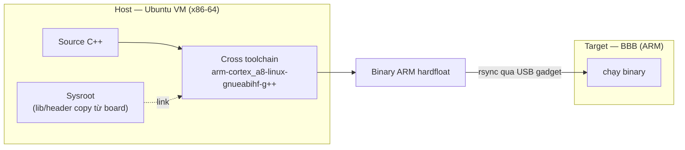

# Kiến thức: Cross-compilation cho ARM (BBB)

> Tài liệu học tập (tiếng Việt theo Rule §18). Nền tảng lý thuyết cho [env_setup.md](../env_setup.md) và CLAUDE.md §11.

---

## 1. Vì sao phải cross-compile?

BBB là Cortex-A8 đơn nhân @1GHz, 512MB RAM. Biên dịch C++ (template, LVGL, libcurl...) ngay trên board thì rất chậm và dễ hết RAM. Giải pháp: **biên dịch trên máy dev (x86-64) nhưng tạo ra mã chạy trên ARM**. Đó là cross-compilation.

- **Host**: máy *chạy compiler* (Ubuntu VM, x86-64).
- **Target**: máy *chạy chương trình* (BBB, ARM hardfloat).
- **Cross toolchain**: bộ gcc/g++/binutils chạy trên host nhưng phát mã cho target.



Tên toolchain mã hóa target: `arm-cortex_a8-linux-gnueabihf`:
- `arm` — kiến trúc
- `cortex_a8` — vi kiến trúc CPU
- `linux` — OS đích
- `gnueabihf` — ABI: GNU EABI **h**ard-**f**loat (FPU phần cứng VFP, không emulate float)

---

## 2. Ba mảnh ghép của một bản build cross đúng

1. **Compiler đúng target** — phát đúng tập lệnh ARM + ABI hardfloat. Sai ABI (softfloat vs hardfloat) → chạy là crash.
2. **Sysroot** — bản sao thư viện + header *của chính board* (`/usr/lib`, `/usr/include`, `/lib`). Để link đúng phiên bản `libasound`, `libcurl`... mà board có. Đoán phiên bản → lỗi `GLIBC_2.xx not found` lúc chạy.
3. **CMake toolchain file** — nói cho CMake biết dùng compiler nào + tìm lib trong sysroot, không trong host (`CMAKE_FIND_ROOT_PATH`).

---

## 3. Vì sao crosstool-ng thay vì gói `gcc-arm-linux-gnueabihf` của apt?

| Tiêu chí | apt `gcc-arm-linux-gnueabihf` | crosstool-ng |
|----------|-------------------------------|--------------|
| Cài đặt | nhanh, một dòng | phải build (lâu lần đầu) |
| Kiểm soát phiên bản glibc | cố định theo Ubuntu | **tự chọn** khớp board |
| Khớp ABI/CPU | chung chung | tinh chỉnh đúng Cortex-A8 |
| Học được gì | ít | hiểu sâu cấu phần toolchain |

Dự án ưu tiên **khớp chính xác glibc của board** (tránh `GLIBC_2.xx not found`) + giá trị học tập → chọn crosstool-ng (CLAUDE.md §11). Đánh đổi: tốn thời gian build toolchain một lần.

> Nguyên tắc vàng: **glibc của toolchain phải ≤ glibc của board**. Binary build với glibc mới hơn sẽ không chạy trên board glibc cũ.

---

## 4. Vì sao sysroot lấy bằng rsync từ board, không tự dựng?

Để **không phải đoán**. Board chạy Debian 12 với bộ phiên bản lib cụ thể. Chép thẳng từ board về:
```bash
rsync -avz gia@192.168.7.2:/usr/lib /usr/include /lib  ~/bbb-sysroot/
```
→ chắc chắn header và `.so` ta link đúng bằng cái runtime board sẽ nạp. Đây là cách rẻ nhất để loại bỏ cả một lớp lỗi ABI.

---

## 5. Kiểm tra nhanh build ra ARM

```bash
file build/bbb-voice-assistant
# ELF 32-bit LSB ... ARM, EABI5 ... dynamically linked  ✔
```
Nếu thấy `x86-64` → bạn build native (quên `-DCMAKE_TOOLCHAIN_FILE`). Nếu chạy trên board báo `Exec format error` → cũng là build sai kiến trúc.

---

## 6. Liên hệ deploy

Toolchain + sysroot xong → build ra binary ARM → đẩy sang board qua USB gadget (`$BBB_PATH` trong [prepare.sh](../../prepare.sh)). Vòng lặp dev: sửa code (VM) → build (VM) → rsync → restart service (board). Chi tiết: [env_setup.md](../env_setup.md) §7.
