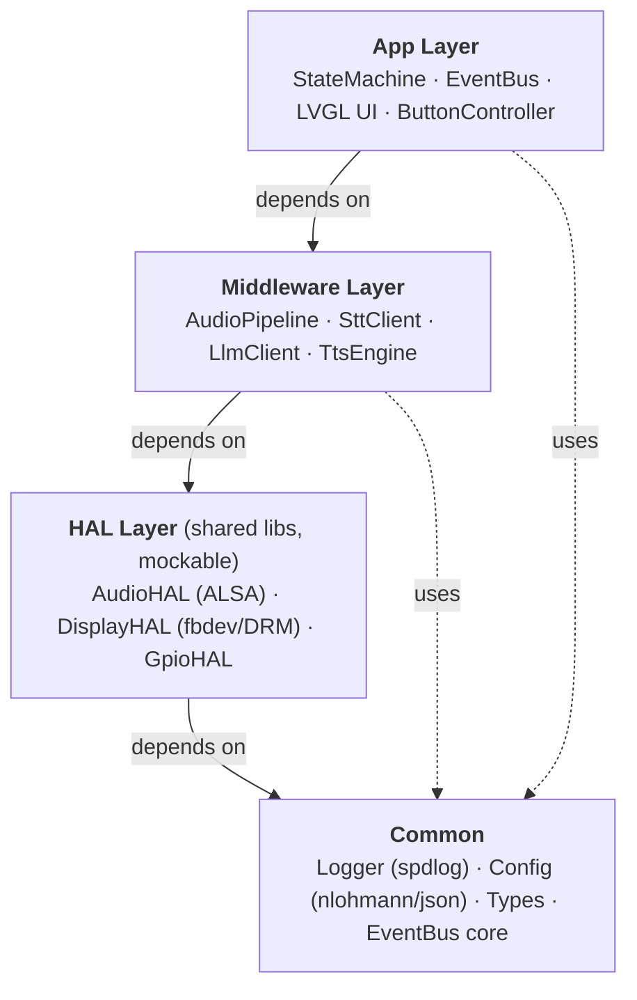
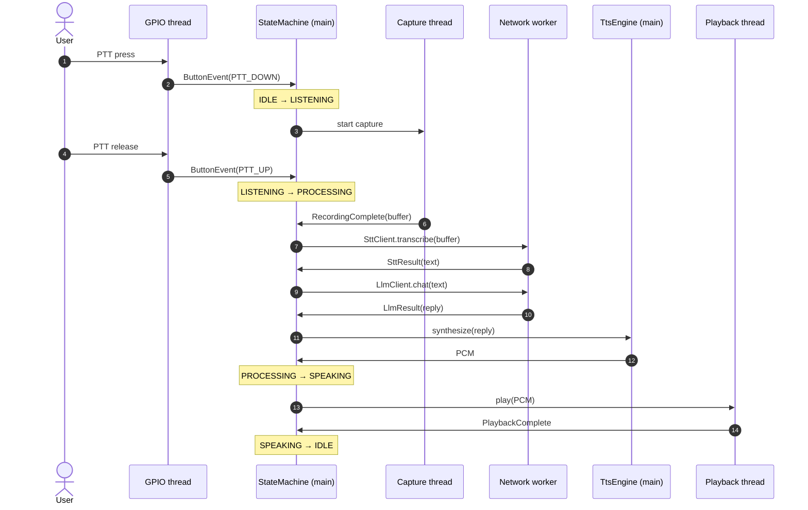
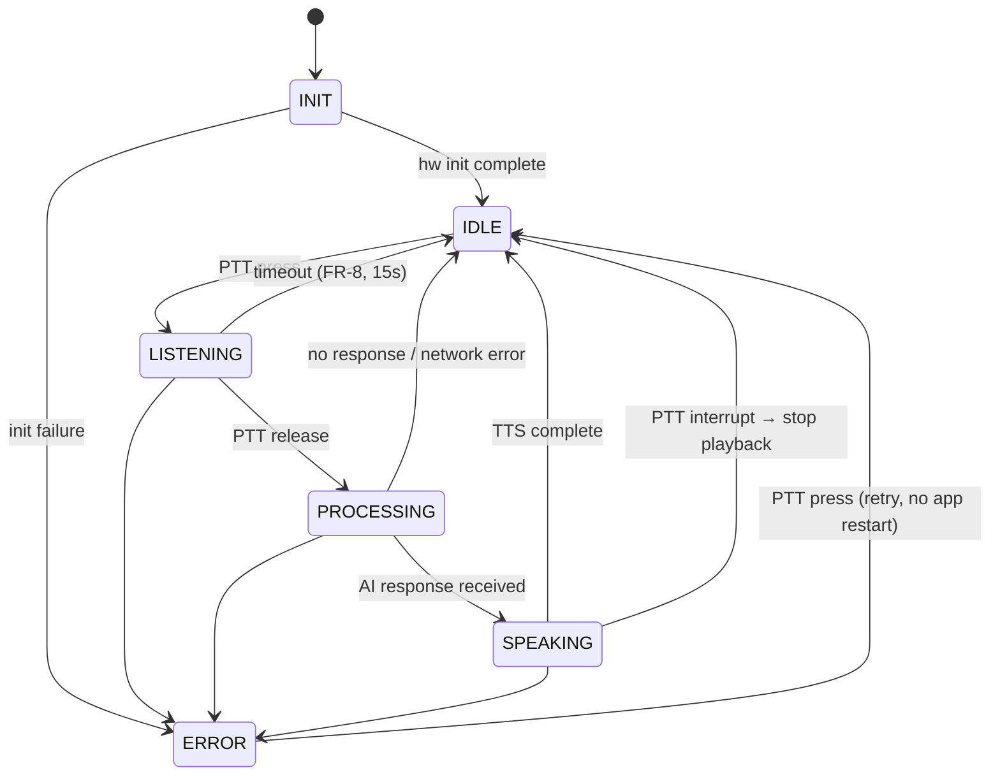

# BBB Voice Assistant — Project Plan

> **BeagleBone Black Voice Assistant** — An embedded Linux voice assistant device integrating a local AI server, displayed on a SPI TFT LCD.

---

## 📋 Overview


### 🎯 Goals
Build a complete embedded Linux device on BeagleBone Black with:
- **Voice Interaction:** Push-to-talk input,speech-to-text via a local Whisper server, chat completion via a local LLM (LM Studio).
- **Visual Feedback:** Status and responses on ILI9341 TFT LCD 320×240 (LVGL UI).
- **Audio Output:** Text-to-speech via eSpeak-ng, record and playback via USB audio.
- **Physical Controls:** PTT + Volume Up/Down buttons, 1 status LED.
- **Driver Development:** Use Legacy fbtft ILI9341 driver - already tested. (TinyDRM in the future if needed)
---

## 💎 Value

| Aspect | Value |
|--------|-------|
| **Learning** | Device driver utilization, HAL design, OOP mindset, Modern C++17, Embedded Linux system programming |
| **Engineering** | Modern C++17, design patterns, embedded linux architecture |
| **Practical** | Production-quality code, error handling, logging, testing |
| **Extensible** | Easy to swap hardware, AI backend, or add new features |

---

## ⚙️ Technical Requirements

### ✅ Functional Requirements

| ID | Requirement | Priority |
|----|-------------|----------|
| FR-1 | Record audio while PTT button is held, or until FR-8 timeout | Must have |
| FR-2 | Speech-to-text via a local Whisper server (separate from LM Studio — see Section 5) | Must have |
| FR-3 | Chat completion with local LLM via LM Studio's OpenAI-compatible API | Must have |
| FR-4 | Text-to-speech (eSpeak-ng) + audio playback | Must have |
| FR-5 | Display status and responses on ILI9341 LCD | Must have |
| FR-6 | Volume control via Vol+/Vol- buttons (software PCM gain — most USB audio adapters have no hardware analog volume control) | Should have |
| FR-7 | LED status indicator (idle / active / error) | Should have |
| FR-8 | Hard recording timeout if PTT is held beyond a configurable max (default 15s) — replaces VAD-based auto-stop, which is out of scope | Must have |

### 📊 Non-Functional Requirements

| ID | Requirement | Target | Notes / Justification |
|----|-------------|--------|-----------------------|
| NFR-1 | Response time (PTT release → TTS audio starts) | < 5 seconds | Budget: network round-trip ~50ms, STT ~0.5-1.5s, LLM ~1-3s (depends on model size/PC), TTS synth ~0.2-0.5s. This is dominated by the PC, not the BBB — keep models small. |
| NFR-2 | RAM usage on BBB | < 200 MB | See Section 10 for the breakdown that makes this achievable. |
| NFR-3 | Boot time | < 30 seconds | Excludes network service availability — boot completing doesn't mean LM Studio/Whisper are reachable yet; app must handle "PC not ready" gracefully on startup. |
| NFR-4 | Audio recording quality | 16 kHz, 16-bit mono | Matches Whisper's native input rate — avoids a resampling step before STT. |
| NFR-5 | Max single recording length | 15 seconds (configurable) | Prevents unbounded memory growth and runaway recordings if PTT release is missed (e.g., GPIO bounce). |

### 🚧 Technical Constraints

| Constraint | Details |
|------------|---------|
| **Hardware** | BeagleBone Black Rev C (512 MB RAM, 4 GB eMMC, 16 GB SD card) |
| **OS** | Linux (kernel 5.10.x), official distro: https://www.beagleboard.org/distros/beaglebone-black-debian-12-14-2026-05-19-iot-v5-10-ti . (A Buildroot tree exists under `buildroot/` as a side experiment for a custom rootfs/kernel — it is **not** the shipping rootfs; the official Debian image is.) |
| **System Configuration** | Device Tree overlay, modify via `/boot/uEnv.txt` |
| **Network** | Two links, two roles: **(a) USB gadget Ethernet (`192.168.7.x`)** — used during development for SSH + `deploy.sh` (no extra cabling, see `prepare.sh`); **(b) RJ45 Ethernet on the LAN** — used at runtime to reach the PC's LM Studio + Whisper server and for general internet (`apt`). Give the BBB a static IP / DHCP reservation on the LAN. (BBB can also reach the internet over the USB gadget link via IP-forwarding/NAT on the dev PC if RJ45 isn't connected.) |
| **AI Server** | LM Studio on a separate PC (OpenAI-compatible chat completions API) |
| **STT Server** | A local Whisper server (`whisper.cpp` server or `faster-whisper-server`) on the same PC, separate process/port from LM Studio |
| **Display** | ILI9341 SPI TFT LCD, 320×240, RGB565 |
| **Audio** | USB audio |
| **Language** | English (STT + LLM + TTS) |
| **Dev Host** | Ubuntu 22.04 Virtual Machine (cross-compiling — see Section 11) |

---

## 4. 🏗️ Architecture

### 4.1 Layers



> Dependencies point **downward only** — an upper layer may use the one below it, never the reverse.

`SttClient` and `LlmClient` are two separate middleware components (each a thin HTTP client) rather than one "AiClient" — they talk to two different servers on the PC with two different APIs. This is the direct fix for the LM-Studio-doesn't-do-STT gap.

### 4.2 Threading model

A single process, multiple threads, one in-process thread-safe queue (`EventBus`). No OS-level IPC (sockets/message queues) is needed since everything runs in one binary — whether the event bus is callback-based or queue-based. **Decision: queue-based.** Callback chaining across threads (GPIO interrupt thread calling directly into LVGL, for instance) is a race-condition trap; a queue with a single consumer avoids that entirely.

| Thread | Owns | Behavior |
|--------|------|----------|
| **Main / Core** | StateMachine, LVGL, EventBus consumer | Loop: wait on queue with a short timeout (e.g. 5–10ms) → dispatch any event to the state machine → call `lv_timer_handler()` → repeat. **All LVGL calls happen only on this thread** — LVGL is not thread-safe, this is non-negotiable. |
| **GPIO thread** | `libgpiod` edge-wait loop for PTT, Vol+, Vol- | Debounces (~20-30ms), pushes `ButtonEvent` onto the queue. Blocking wait, low CPU. |
| **Audio capture thread** | ALSA capture loop | Runs only while in `LISTENING`; fills a buffer; pushes `RecordingComplete(buffer)` or `RecordingTimeout` (FR-8) onto the queue. |
| **Audio playback thread** | ALSA playback loop | Consumes TTS PCM; pushes `PlaybackComplete` onto the queue. |
| **Network worker thread(s)** | `SttClient`, `LlmClient` HTTP calls (libcurl) | Small thread pool (2 is enough); each call pushes a `SttResult` / `LlmResult` / `NetworkError` event onto the queue on completion. Never block the main thread on a network call. |

### 4.3 Sequence: one PTT interaction



### 4.4 Display driver — decision gate (resolve in Week 1, Day 1)

- **(Decided)`fbtft`/`fb_ili9341` is available:** `/dev/fb0` is available and terminal appears on that directly, LVGL's fbdev backend works unmodified, and this matches the original plan (good learning value, simplest path).
- **(Future upgrade) DRM is available (likely on a 6.12.x kernel):** use the generic `panel-mipi-dbi-spi` driver via a Device Tree overlay, and switch LVGL to its DRM backend (dumb-buffer mmap) instead of fbdev. This is the actively-maintained path going forward.
- **(Future upgrade) Custom SPI Driver:** fall back to a custom `spidev` userspace driver (already listed as a future alternative) — more work, but it was already your stated fallback and gives full control.

---

## 5. 🌐 Network & Service Topology

| Component | Host | Port (example — confirm in each tool's docs) | Notes |
|-----------|------|------|-------|
| LM Studio server | PC | `1234` | OpenAI-compatible `/v1/chat/completions` |
| Whisper server | PC | e.g. `9000` (whisper.cpp server default differs by build) | Confirm exact endpoint path when you set it up — `whisper.cpp`'s bundled server and third-party OpenAI-shaped wrappers (`faster-whisper-server`) use different paths; don't assume `/v1/audio/transcriptions` works until you've tested it against your specific server. |
| BBB app | BeagleBone | — | Reaches both servers over the **RJ45 LAN** at runtime, via static LAN IPs in `config.json` |

Two physical links, distinct roles:
- **USB gadget Ethernet (`192.168.7.x`)** — development only: SSH + `deploy.sh` push the binary/config to the board (see `prepare.sh`, which targets `gia@192.168.7.2`). Convenient because it's the same USB cable that powers the board.
- **RJ45 Ethernet (LAN)** — runtime: the app connects out to LM Studio + Whisper on the PC, and the board uses this for `apt`/internet. The two AI server IPs in `config.json` are LAN IPs, not `192.168.7.x`.

Recommendations:
- Give the PC and BBB static IPs on the LAN (or DHCP reservations) so `config.json` doesn't need to change every reboot.
- Both LM Studio's and the Whisper server's APIs are unauthenticated by default — fine on an isolated LAN, but if the BBB or PC also has general internet access (per the constraints table), make sure these ports aren't reachable from outside your LAN (router NAT alone is usually enough; don't port-forward them).
- Add a connectivity check on app startup (and a visible "PC unreachable" state on the LCD) — NFR-3 only covers BBB boot time, not whether the PC's servers are up yet.

---

## 6. ⚖️ Technical Decisions

| Component | Choice | Key Reason | Future Alternative |
|-----------|--------|------------|--------------------|
| Audio | **ALSA (libasound)** | Embedded standard, direct HW access | PulseAudio / Pipewire |
| TTS | **eSpeak-ng** | Offline, lightweight, no server needed | Kokoro / Cloud TTS |
| LLM | **LM Studio** | Local, easy setup, OpenAI-compatible | Ollama / vLLM |
| STT | **whisper.cpp server / faster-whisper-server** (separate from LLM) | LM Studio has no transcription endpoint as of mid-2026 | Cloud STT (out of scope per privacy goal) |
| GUI | **LVGL** | Lightweight, production-proven | Qt Embedded |
| Display Driver | fbtft is available and it's working normally | Quick and simple | DRM driver, custom spidev driver |
| Event Bus | **In-process thread-safe queue, single consumer (main thread)** | Avoids cross-thread races into LVGL; simplest correct model for one process | — |
| JSON | **nlohmann/json** | Header-only, modern C++, readable | Protobuf (performance) |
| Logging | **spdlog** | Fast, async, modern C++ | syslog |
| GPIO | **libgpiod** | Modern chardev API, actively maintained | sysfs (legacy, deprecated) |
| HTTP | **libcurl** | Robust, well-tested for REST calls | cpp-httplib (header-only) |
| Network topology | **RJ45 Ethernet (static IPs) at runtime + USB gadget (`192.168.7.x`) for dev/deploy** | RJ45 gives one LAN for both PC servers and internet; USB gadget gives single-cable power+data during development | Single link only (drop USB gadget once on-LAN) |

---

## 7. 🗂️ Project Structure

> Dirs/files marked `(planned)` don't exist yet — they're the target layout for Weeks 2–4. Everything else is in the repo today.

```
AI-Voice-Assistant/
├── CLAUDE.md                         # this file — the master plan
├── CHECK_LIST.md                     # live bring-up / progress tracking
├── README.md
├── prepare.sh                        # exports cross-toolchain PATH + BBB_PATH (deploy target)
├── CMakeLists.txt                    # (planned) top-level build
├── toolchain/                        # (planned) bbb-toolchain.cmake — CMake cross-compile file (Section 11)
│   └── bbb-toolchain.cmake
├── .toolchain/
│   └── crosstool-ng/                 # crosstool-ng source tree (builds arm-cortex_a8-linux-gnueabihf)
├── buildroot/                        # side experiment for a custom rootfs/kernel — NOT the shipping rootfs
│   └── my_config/.config
├── .docs/
│   ├── architecture.md               # interfaces, thread model, chosen display-driver path (EN)
│   ├── env_setup.md                  # toolchain, sysroot, deploy loop (EN)
│   ├── server_setup.md               # PC AI server (LM Studio + faster-whisper) setup (EN)
│   ├── timeline.md                   # 4-week day-by-day plan (EN)
│   ├── troubleshooting.md            # symptom→cause→fix by subsystem (EN)
│   ├── development/                  # coding_guide / testing / device_driver / hal_layer / app_layer (Vietnamese, see §18)
│   ├── implementation/               # per-component build guides, numbered 00..11 + README (Vietnamese, see §18)
│   └── knowledge/                    # strategy_roadmap / threading / audio_alsa / cross_compile / ai_server + README (Vietnamese, see §18)
│
├── hal/                              # (planned) HAL Layer
│   ├── include/
│   ├── audio/
│   ├── display/                      # fbdev OR drm backend, per architecture.md decision
│   └── gpio/
│
├── middleware/                       # (planned) Middleware Layer
│   ├── audio_pipeline/
│   ├── stt_client/                   # talks to the local Whisper server
│   ├── llm_client/                   # talks to LM Studio only
│   └── tts/
│
├── app/                              # Application Layer
│   ├── CMakeLists.txt
│   └── main.cpp                      # current entry point (hardware quick-test stage)
│
├── common/                           # (planned)
│   ├── Logger.hpp
│   ├── Config.hpp
│   ├── Types.hpp
│   └── EventBus.hpp                  # queue-based, see Section 4.2
│
├── config/                           # (planned)
│   └── config.json                   # host/port for LM Studio + Whisper server, GPIO pin map, timeouts
│
├── scripts/                          # (planned)
│   ├── build.sh
│   ├── deploy.sh                     # rsync/scp binary + restart systemd service
│   └── check_board.sh                # runs the Section 4.4 driver-availability checks
│
├── tests/                            # (planned)
│   ├── hal/
│   ├── middleware/
│   └── app/
│
└── kernel/
    └── overlays/
        ├── BBB-VOICE-ASSISTANT.dts   # device tree overlay (SPI0 + ILI9341 fbtft + GPIO)
        └── copy_dtbo.sh              # builds/installs the compiled overlay to the board
```
---

## 8. State Machine

VAD removed (out of scope per your own decision log); replaced with the FR-8 hard timeout.



### Valid state transitions

| From | To (allowed) |
|------|--------------|
| INIT | IDLE, ERROR |
| IDLE | LISTENING, ERROR |
| LISTENING | PROCESSING, IDLE (timeout, FR-8), ERROR |
| PROCESSING | SPEAKING, IDLE (no response / network error), ERROR |
| SPEAKING | IDLE (TTS complete / interrupt), ERROR |
| ERROR | IDLE (restart app) |

---

## 9. Error Handling & Recovery

| Failure | Detection | Recovery |
|---------|-----------|----------|
| PC / LM Studio unreachable | HTTP connect timeout (set short, e.g. 3s) | State → ERROR → LED error pattern → LCD shows "AI server unreachable" → auto-retry on next PTT press, no app restart needed |
| Whisper server unreachable | Same as above, on the STT call | Same — surfaced distinctly from LLM errors so you can tell which service is down |
| eSpeak-ng process fails / not installed | Non-zero exit code or spawn failure | Log + fall back to a short error beep/LED pattern rather than silently hanging in SPEAKING |
| USB audio device disconnected mid-recording | ALSA write/read error | Abort recording, return to IDLE, LED error blink, log event |
| GPIO bounce / stuck PTT | FR-8 timeout | Auto-return to IDLE after max recording length |

---

## 10. 📐 Memory & Resource Budget (justifying NFR-2: <200MB)

| Component | Approx. RAM |
|-----------|-------------|
| Linux kernel + base Debian userspace | ~60–90 MB |
| App binary + shared libs (HAL/middleware loaded) | ~15–25 MB |
| LVGL framebuffer (320×240 × RGB565, double-buffered) | ~300 KB — negligible |
| Audio capture buffer (15s max @ 16kHz/16-bit mono) | ~480 KB — negligible |
| libcurl + network buffers | a few MB |
| eSpeak-ng (spawned per utterance, short-lived) | a few MB while running |
| **Headroom** | comfortably under 200MB total on a 512MB board, even with margin for kernel page cache |

This budget confirms NFR-2 is realistic without needing to do anything unusual — no AI model weights live on the BBB itself, which is the part that would actually threaten the budget.

---

## 11. Build & Deployment Strategy

Building natively on the BBB (single-core Cortex-A8 @ 1GHz, 512MB RAM) is slow and not recommended for iterative development.

1. **Cross-compile on the Ubuntu 22.04 VM** using a **crosstool-ng**-built toolchain targeting the BBB's Cortex-A8 hard-float userspace. The toolchain is built from the `.toolchain/crosstool-ng/` tree and installed to `/home/gia/x-tools/arm-cortex_a8-linux-gnueabihf/` (prefix `arm-cortex_a8-linux-gnueabihf-`). `prepare.sh` puts its `bin/` on `PATH` and exports `BBB_PATH` for deploys. (crosstool-ng is chosen over a packaged `gcc-arm-linux-gnueabihf` so the toolchain's glibc/ABI is pinned to match the board exactly.)
2. **Build a sysroot** by copying `/usr/lib`, `/usr/include`, and relevant headers from the actual BBB (via `rsync` over the network) rather than guessing library versions — this avoids ABI mismatches with whatever libcurl/ALSA versions ship on the board.
3. **Write a CMake toolchain file** (`toolchain/bbb-toolchain.cmake`) setting `CMAKE_SYSTEM_NAME=Linux`, `CMAKE_SYSTEM_PROCESSOR=arm`, the `arm-cortex_a8-linux-gnueabihf-` compiler paths, and `CMAKE_FIND_ROOT_PATH` to the sysroot.
4. **`scripts/deploy.sh`** should `rsync`/`scp` the built binary + `config/config.json` to the BBB (over the USB gadget link, `$BBB_PATH`) and restart the systemd service — don't hand-copy files during development, it doesn't scale past day 2.
5. **systemd service**, not a manual run script, for the final deliverable — gives you auto-restart on crash and clean boot integration, and is what NFR-3 (boot time) implicitly assumes.
---

## 12. ⚠️ Risk Register

| Risk | Impact | Mitigation |
|------|--------|------------|
| LM Studio has no native STT (confirmed during this review) | High — blocks FR-2 entirely if unaddressed | Already resolved by adding a separate Whisper server — but verify its exact API shape against your chosen build before writing `SttClient` |
| USB audio adapter doesn't support 16kHz natively | Medium | Test with `arecord -D plughw:CARD=... -f S16_LE -r 16000 -c 1` before any C++ is written; `plughw` resamples automatically, `hw` does not |
| Cheap USB audio adapter has no usable hardware volume control | Low-medium | FR-6 already planned for software PCM gain — confirm this in Week 1 with `amixer -c <card> scontrols` |
| LVGL called from a non-main thread by accident | Medium — intermittent, hard-to-debug crashes | Threading model in Section 4.2 enforces single-thread LVGL access by design; enforce in code review |
| BBB single-core CPU contention between LVGL redraw, audio I/O, and network | Low | All AI compute is offloaded to the PC; keep LVGL refresh rate modest (state-change-driven, not continuous animation) |

---

## 13. 📅 Timeline Overview

| Week | Phase | Deliverables |
|------|-------|-------------|
| **1** | Foundation | BBB boots from SD, SSH access, **display-driver decision gate resolved (Section 4.4)**, SPI/GPIO device tree, USB audio verified at 16kHz, Ethernet link to PC with static IPs, Whisper server + LM Studio both reachable from BBB via `curl` |
| **2** | HAL Layer | AudioHAL, DisplayHAL (per chosen driver path), GpioHAL as shared libs, CMake structure, cross-compile toolchain working end-to-end, mock-based unit tests |
| **3** | Middleware + App | AudioPipeline, SttClient, LlmClient, TtsEngine, EventBus, StateMachine, LVGL UI, ButtonController |
| **4** | Integration | Full end-to-end pipeline (PTT → STT → LLM → TTS → playback), error handling per Section 9, systemd service, final documentation |

(Day-by-day breakdown belongs in `docs/timeline.md` per your documentation index — Week 1 is the highest-risk week given the open driver/kernel question, so front-load the decision gate there rather than letting it slip into Week 2.)

---

## 14. ✅ Acceptance Criteria / Definition of Done

- Holding PTT and speaking a short question, then releasing, results in an audible spoken answer within NFR-1's 5-second budget, with the LCD reflecting INIT → IDLE → LISTENING → PROCESSING → SPEAKING → IDLE visibly at each stage.
- Disconnecting the PC (or stopping LM Studio/Whisper) produces a visible, non-crashing ERROR state with a clear LCD message, and recovers automatically on the next PTT press once services are back.
- Vol+/Vol- buttons audibly change TTS playback volume.
- The app survives a `systemctl restart` and a full power cycle without manual intervention.
- RAM usage measured on-device (`free -m`) stays under the 200MB NFR-2 target during a full PTT round trip.
- Unit tests (mock-based, per `tests/`) pass in CI/local build for HAL, middleware, and state machine logic.

---

## 15. 📚 Documentation Index

| Document | Content | Lang |
|----------|---------|------|
| [CLAUDE.md](CLAUDE.md) | Overview, requirements, architecture, decisions (this file) | EN |
| [CHECK_LIST.md](CHECK_LIST.md) | Tracking current status | mixed |
| [.docs/architecture.md](.docs/architecture.md) | Interface definitions, class sketches, thread model, **chosen display-driver path and why** | EN |
| [.docs/hardware_setup.md](.docs/hardware_setup.md) | Physical wiring: full pin map, SPI0 LCD+touch topology, button circuits, LED, bring-up checklist | EN |
| [.docs/env_setup.md](.docs/env_setup.md) | Setup environment, packages, dependencies, crosstool-ng toolchain | EN |
| [.docs/server_setup.md](.docs/server_setup.md) | PC AI server setup: LM Studio + faster-whisper-server on Windows+NVIDIA, LAN exposure | EN |
| [.docs/timeline.md](.docs/timeline.md) | 4-week plan with daily tasks | EN |
| [.docs/troubleshooting.md](.docs/troubleshooting.md) | Common issues and solutions, by subsystem | EN |
| [.docs/development/coding_guide.md](.docs/development/coding_guide.md) | C++17 patterns, error handling, design patterns, logging, conventions | VI |
| [.docs/development/testing.md](.docs/development/testing.md) | Host unit-test setup (GoogleTest + CTest + sanitizers), test philosophy | VI |
| [.docs/development/device_driver.md](.docs/development/device_driver.md) | SPI, Device Tree overlay, fbtft binding for ILI9341 | VI |
| [.docs/development/hal_layer.md](.docs/development/hal_layer.md) | HAL interface design, shared library, mock pattern | VI |
| [.docs/development/app_layer.md](.docs/development/app_layer.md) | State machine, EventBus, LVGL UI, ButtonController | VI |
| [.docs/implementation/](.docs/implementation/README.md) | Per-component build guides (scaffold + algorithm hints + tests), build order | VI |
| [.docs/knowledge/](.docs/knowledge/README.md) | Foundations: concurrency, ALSA audio, cross-compilation, AI server | VI |

---

## 16. Key Decisions Log

| # | Decision | Options | Chosen | Rationale |
|---|----------|---------|--------|-----------|
| 1 | GUI Framework + Backend | Raw FB/LVGL/Qt | **LVGL** | Lightweight, production-grade |
| 2 | Audio API + Codec | ALSA/PulseAudio | **ALSA + USB Audio** | Easy to use, embedded standard |
| 3 | Voice Trigger | Wake word/PTT | **Push-to-talk (PTT)** | Simpler, reliable, practical |
| 4 | AI Backend + Network | Cloud/Local + Eth/USB | **Local; RJ45 LAN at runtime, USB gadget (`192.168.7.x`) for dev/deploy** | Privacy (local only); RJ45 reaches PC servers + internet, USB gadget is the convenient single-cable dev/deploy link (see `prepare.sh`) |
| 5 | TTS | eSpeak-ng/Flite/Remote | **eSpeak-ng** | Offline, lightweight, good enough |
| 6 | STT | None specified | **whisper.cpp server / faster-whisper-server, separate from LM Studio** | LM Studio has no transcription endpoint (confirmed during this review) |
| 7 | Serialization | Protobuf/JSON/CBOR | **JSON** | Human-readable, simple |
| 8 | GPIO API | sysfs/libgpiod | **libgpiod** | Modern, chardev, not deprecated |
| 9 | Event Bus | Callback chaining/queue | **In-process thread-safe queue, single consumer** | Avoids cross-thread races into LVGL |
| 10 | LCD Driver | fbtft / DRM / custom spidev | **fbtft** | fbtft ili9341 |

---

## 17. 🚫 Out of Scope (Future Considerations)

- Wake word / hotword detection (PTT only for now)
- Voice Activity Detection (VAD) for auto-stop — explicitly removed from the state machine in this revision to match the PTT-only decision; PTT release + FR-8 timeout cover it
- Vietnamese or multi-language support (English only)
- Cloud AI integration (local only)
- OTA firmware updates

---

## 18. Rules
- Only **`.docs/development/...`**, **`.docs/knowledge/...`** and **`.docs/implementation/...`** documents are written in Vietnamese (not everything, if some terminologies/keywords/... are easier to understand in English, use it.)
- **`.docs/development/...`**, **`.docs/knowledge/...`** and **`.docs/implementation/...`** should be written for best learning purpose: System thinking, Foundation thinking, Comparing available solutions, Making decisions,...
- **`.docs/implementation/...`** guides provide scaffolding (interface, build order, algorithm hints, test harness) with bodies left as `// TODO(you)` — they must **not** become copy-paste full solutions. Gia hand-codes; Claude reviews.
- **Coding Style**: Standard Modern C++ style is prefer, details in coding_guide.md.
- The rest of documents must be written in English, even when our converstations are in Vietnamese.
- All topics must be explained clearly, **DO NOT** over-engineering, over-complicated.